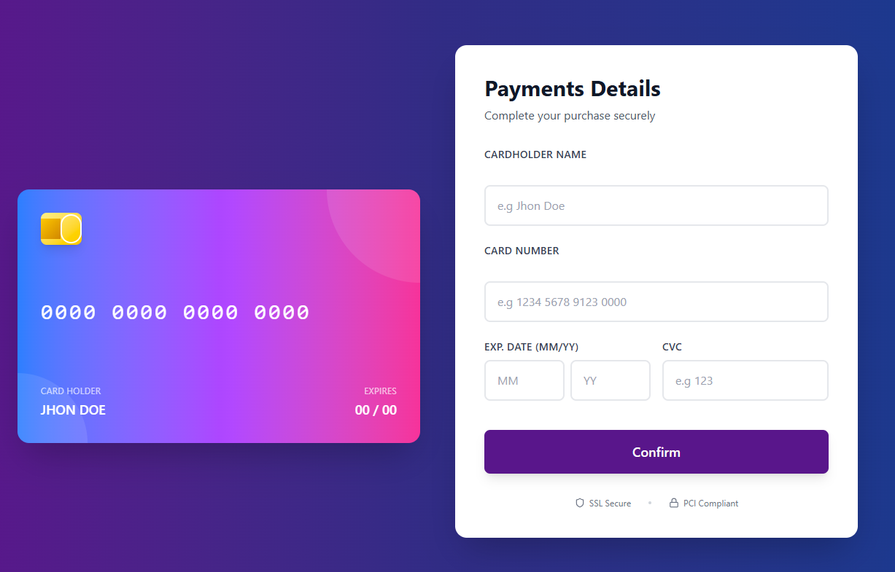
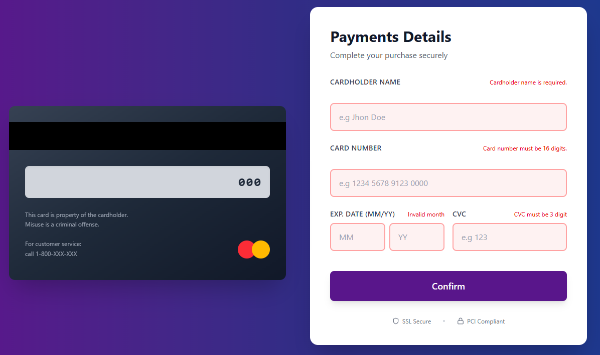

# React Credit Card Form & Preview

A modern **React** project that provides a sleek credit card input form with real-time card preview, validation, and flip animation for CVC. Built with **Tailwind CSS** and **React Hooks** for a smooth, responsive, and interactive UI.

---

## 🚀 Features

- **Real-time Card Preview**: Update card number, holder name, expiry, and CVC dynamically.
- **Card Flip Animation**: Focus on CVC flips the card to show the back.
- **Form Validation**:
  - Card number must be 16 digits
  - Expiry month (01–12)
  - Expiry year (valid range)
  - CVC must be 3 digits
- **Tailwind CSS Styling**: Fully responsive, mobile-friendly, and modern design.
- **Secure UX Indicators**: SSL Secure & PCI Compliant badges.
- **Formatted Card Number**: Spaces added automatically for readability (e.g., `1234 5678 9123 0000`).

---

## 📂 Project Structure

```
src/
├─ components/
│  ├─ CardForm.jsx         # Main form component
│  ├─ CardFormFields.jsx   # Form fields with validation
│  ├─ CardPreview.jsx      # Card front & back container
│  ├─ CardFront.jsx        # Front side of the card
│  └─ CardBack.jsx         # Back side of the card
├─ utils/
│  └─ FormatCardNumber.js  # Format card number function
├─ App.jsx
└─ index.js
```

---

## 📝 Usage

- Fill in **Cardholder Name**, **Card Number**, **Expiry Month/Year**, and **CVC**.
- Card preview updates live.
- Focusing on the CVC field flips the card to the back.
- Submit the form to validate the input.

---

## 🎨 Technologies Used

- **React 18**
- **Tailwind CSS 3**
- **Lucide React** (Icons)
- **Vite** (Build tool)

---

## 🔧 Scripts

- `npm run dev` → Start development server
- `npm run build` → Build production-ready files
- `npm run preview` → Preview production build

---

## 📸 Screenshots

**Form & Card Preview**



**Card Flipped (CVC)**



---

## 🔒 Security

- SSL Secure badge displayed
- PCI Compliant badge displayed

---

## ✨ Author

[GitHub Profile](https://github.com/JoynulIslam)

---
